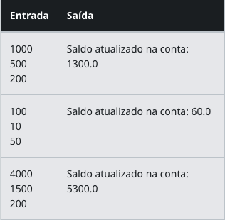

# Descrição
Para esse desafio, considere que você foi contratado por uma empresa bancária para auxiliar nas implementações e melhorias do sistema empresarial. Em uma análise inicial, foi identificado pela equipe financeira a necessidade de desenvolver uma solução que permita ao cliente equilibrar seu saldo bancário. Dessa forma, o programa deve solicitar uma entrada que representa o saldo atual do funcionário, e após, seja informado o valor de duas transações, sendo elas: um depósito e um saque. O programa deve atualizar o saldo com base nas transações e exibir o saldo final.

**Informação:** As transações de depósito e retirada devem ser tratadas como valores positivos e negativos, respectivamente, para garantir que o cálculo do saldo final seja realizado corretamente.
 

# Entrada
**saldoAtual:** um número decimal representando o saldo atual da conta bancária.
**valorDeposito:** um número decimal representando o valor a ser depositado na conta.
**valorRetirada:** um número decimal representando o valor a ser retirado da conta.

Regra de Formatação: Considere apenas uma casa decimal para esse desafio.

# Saída
 Um número decimal que representa o saldo atualizado na conta bancária após o processamento das transações.

# Exemplos
A tabela abaixo apresenta exemplos com alguns dados de entrada e suas respectivas saídas esperadas. Certifique-se de testar seu programa com esses exemplos e com outros casos possíveis.

