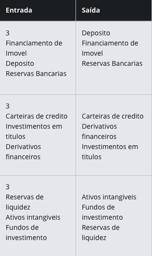

# Descrição
Após uma análise cuidadosa realizada pela equipe de desenvolvimento de uma empresa bancaria, foi identificado a necessidade de uma nova funcionalidade para otimizar os processos e melhorias da experiência dos usuários.
 Agora, sua tarefa é implementar uma solução que organize em ordem alfabética uma lista de ativos que será informada pelos usuários.
  Os ativos são representados por strings que representam seus tipos, como por exemplo: Reservas de liquidez, Ativos intangiveis e dentre outros.

# Entrada
A primeira entrada consiste em um número inteiro que representa a  quantidade de ativos que o usuário possui. 
Em seguida, o usuário deverá  informar, em linhas separadas, os tipos (strings) dos respectivos ativos.

# Saída
Seu programa deve exibir a lista de Ativos organizada em ordem alfabética. Cada ativo deve ser apresentado em uma linha separada.

# Exemplos
A tabela abaixo apresenta exemplos com alguns dados de entrada e suas respectivas saídas esperadas. Certifique-se de testar seu programa com esses exemplos e com outros casos possíveis.

